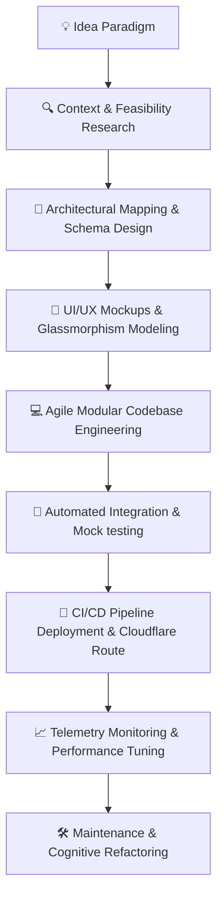

<!--
  ███▄    █   ▄████▄   ▀████▀     ▄▄▄▄      ▄█    █▄  ▄████▄   ▄█
  ██ ▀█   █  ██▀ ▀██     ██     ▄▀  ▀▀▄   ▄███▄  ▄██  ██▀ ▀██  ██
  ██  ▀█  █  ██          ██     █   ▄   ▄ ██ ▀█  █ ██ ██       ██
  ██   ▀█ █  ██          ██     ███████▄  ██   ██  ██ ██       ██
  ██    ▀██  ██          ██     ██    ██  ██       ██ ██       ██
  ██     ██  ██▄ ▄██     ██     ██    ██  ██       ██ ██▄ ▄██  ██
  ██      █   ▀████▀   ▄████▄    ▀████▀    █        █  ▀████▀  █▀

  ✨ PREMIUM GITHUB PROFILE ARCHITECTURE FOR @nqxkhoi (Nguyễn Minh Khôi)
  Designed with futuristic cyber glassmorphism, adaptive grid layouts,
  interactive shields, real-time workflow paradigms, and advanced AI matrices.
-->

<p align="center">
  <!-- Glowing Interactive Animated Custom SVG Banner -->
  <svg width="100%" height="260" viewBox="0 0 800 260" fill="none" xmlns="http://www.w3.org/2000/svg">
    <style>
      .bg { fill: #0a0b10; }
      .grid { stroke: #161925; stroke-width: 0.5; opacity: 0.6; }
      .glow-path { stroke: url(#cyber-glow); stroke-width: 2; stroke-linecap: round; filter: url(#neon-glow); }
      .title { font-family: 'Space Grotesk', 'Segoe UI', system-ui, sans-serif; font-weight: 800; font-size: 36px; fill: url(#neon-grad); letter-spacing: 5px; }
      .subtitle { font-family: 'JetBrains Mono', 'Fira Code', monospace; font-size: 14px; fill: #00ffcc; font-weight: 600; letter-spacing: 4px; opacity: 0.95; }
      .meta { font-family: 'Segoe UI', system-ui, sans-serif; font-size: 11px; fill: #6c729c; letter-spacing: 2.5px; }
      .accent-dot { fill: #7000ff; filter: url(#neon-glow); }
      .pulse-dot { fill: #00ffcc; filter: url(#neon-glow); animation: pulse 3s infinite ease-in-out; }
      @keyframes pulse {
        0% { opacity: 0.2; r: 3px; }
        50% { opacity: 0.9; r: 5px; }
        100% { opacity: 0.2; r: 3px; }
      }
      @keyframes flow {
        0% { stroke-dashoffset: 800; }
        100% { stroke-dashoffset: 0; }
      }
      .flow-line { stroke-dasharray: 60, 120; animation: flow 24s linear infinite; }
    </style>
    
    <defs>
      <linearGradient id="neon-grad" x1="0%" y1="0%" x2="100%" y2="100%">
        <stop offset="0%" stop-color="#00ffcc" />
        <stop offset="50%" stop-color="#7000ff" />
        <stop offset="100%" stop-color="#ff007f" />
      </linearGradient>
      
      <linearGradient id="cyber-glow" x1="0%" y1="0%" x2="100%" y2="0%">
        <stop offset="0%" stop-color="#00ffcc" stop-opacity="0" />
        <stop offset="30%" stop-color="#7000ff" stop-opacity="0.8" />
        <stop offset="70%" stop-color="#ff007f" stop-opacity="0.8" />
        <stop offset="100%" stop-color="#ff007f" stop-opacity="0" />
      </linearGradient>

      <filter id="neon-glow" x="-20%" y="-20%" width="140%" height="140%">
        <feGaussianBlur stdDeviation="5" result="blur" />
        <feMerge>
          <feMergeNode in="blur" />
          <feMergeNode in="SourceGraphic" />
        </feMerge>
      </filter>
    </defs>

    <!-- Background -->
    <rect width="100%" height="100%" rx="16" class="bg" />
    
    <!-- Cyber Grid Layout -->
    <path d="M 0 30 L 800 30 M 0 60 L 800 60 M 0 90 L 800 90 M 0 120 L 800 120 M 0 150 L 800 150 M 0 180 L 800 180 M 0 210 L 800 210 L 800 240 M 0 240 L 800 240" class="grid" />
    <path d="M 60 0 L 60 260 M 120 0 L 120 260 M 180 0 L 180 260 M 240 0 L 240 260 M 300 0 L 300 260 M 360 0 L 360 260 M 420 0 L 420 260 M 480 0 L 480 260 M 540 0 L 540 260 M 600 0 L 600 260 M 660 0 L 660 260 M 720 0 L 720 260" class="grid" />

    <!-- Animated Flux Lines -->
    <path d="M 60 90 L 180 90 L 210 120 L 390 120 L 420 150 L 580 150 L 610 180 L 740 180" fill="none" class="glow-path flow-line" />
    <path d="M 740 180 L 620 180 L 590 150 L 410 150 L 380 120 L 220 120 L 190 90 L 60 90" fill="none" class="glow-path flow-line" style="animation-direction: reverse;" />

    <!-- Cyber Connectors -->
    <circle cx="210" cy="120" r="3.5" class="accent-dot" />
    <circle cx="420" cy="150" r="4.5" class="pulse-dot" />
    <circle cx="610" cy="180" r="3.5" class="accent-dot" />
    
    <!-- Main Typography -->
    <text x="400" y="105" text-anchor="middle" class="title">NGUYÊN MINH KHÔI</text>
    <text x="400" y="145" text-anchor="middle" class="subtitle">AI SYSTEMS & WORKFLOW ARCHITECT</text>
    <text x="400" y="180" text-anchor="middle" class="meta">📍 CẦN THƠ, VIỆT NAM • SGM NETWORK MEMBER</text>
  </svg>
</p>

<p align="center">
  <!-- Interactive animated typing effect -->
  <a href="https://git.io/typing-svg">
    
  </a>
</p>

<p align="center">
  <!-- Glowing Social Shields with unified dark glassmorphism styling -->
  <a href="https://github.com/nqxkhoi">
    
  </a>
  <a href="mailto:nguyenminhkhoi.booking@gmail.com">
    
  </a>
  <a href="https://facebook.com">
    
  </a>
  <a href="https://instagram.com">
    
  </a>
  <a href="https://youtube.com">
    
  </a>
  <a href="https://discord.gg">
    
  </a>
</p>

<p align="center">
  <!-- Real-time visitor counts with premium cyber alignment label -->
  
</p>

---

## 🚀 INTRODUCTORY FLUX

I am **Nguyễn Minh Khôi** (alias `@nqxkhoi`), an AI Application Developer, Workflow Automation Specialist, and Digital Content Creator stationed in Cần Thơ, Việt Nam.

Operating at the core of **Artificial Intelligence** and **Modern Web Architectures**, I build autonomous agentic pipelines, design next-generation full-stack web platforms, and craft seamless digital experiences. As an active collaborator for **Garena Free Fire Vietnam** and a proud member of the **SGM Network**, I merge complex software paradigms with interactive media strategies to deliver systems that think, scale, and inspire.

My mission is to engineer systems that remove operational friction through cognitive intelligence. Whether deploying custom LLM-powered applications, mapping complex multi-agent flows, or structuring responsive frontend aesthetics, I aim for nothing less than absolute engineering excellence.

---

## 🧬 IDENTITY MATRIX & TELEMETRY

<table align="center" width="100%">
  <tr>
    <td width="50%" valign="top">
      <h3>📡 SYS OPERATIONAL CODES</h3>
      <ul>
        <li><b>🌌 Full Name:</b> Nguyễn Minh Khôi</li>
        <li><b>📅 Birth Datum:</b> 01 June 2008</li>
        <li><b>📍 Coordinates:</b> Cần Thơ, Việt Nam</li>
        <li><b>💼 Main Focus:</b> AI App Development & Cognitive Workflow Design</li>
        <li><b>🎮 Creative Role:</b> Garena Free Fire Creator & SGM Network Member</li>
      </ul>
    </td>
    <td width="50%" valign="top">
      <h3>🧠 EXPERIMENTAL FOCUS</h3>
      <ul>
        <li><b>🛠️ Daily Stack:</b> TypeScript, Python, Next.js, Kotlin Compose</li>
        <li><b>🦾 Core Research:</b> Multi-agent orchestration, RAG, and MCP Protocol</li>
        <li><b>🌱 Currently Learning:</b> Model quantization & local Edge-AI runtimes</li>
        <li><b>📫 Collaborative Scope:</b> Autonomous systems, API integrations, consulting</li>
        <li><b>🎨 Creative Focus:</b> High-fidelity motion designs, video automation engines</li>
      </ul>
    </td>
  </tr>
</table>

---

## 🤖 COGNITIVE ARTIFICIAL INTELLIGENCE

<p align="left">
  
  
  
  
  
  
  
  
  
</p>

### 🦾 Agentic Automations & Neural Workflows
*   **Decentralized Multi-Agent Flowbases**: Constructing resilient, event-driven task networks utilizing **n8n** and **Make** to automate digital assets generation, content scheduling, and metadata indexing.
*   **Model Context Protocol (MCP)**: Building bespoke host-client systems enabling LLMs to dynamically query and mutate operational contexts, filesystems, and Cloud DB records on-demand.
*   **Context Optimization & RAG**: Designing optimized embedding pipelines with custom chunking models, achieving high semantic search accuracy on specialized datasets.

---

## 🛠️ CYBER TECH STACK

### 💻 Programming & Core Languages
<p align="left">
  
  
  
  
  
  
  
  
  
</p>

### 🎨 Frontend & UI Architecture
<p align="left">
  
  
  
  
  
  
  
  
</p>

### ⚙️ Backend & Database Matrices
<p align="left">
  
  
  
  
  
  
  
  
  
</p>

### ☁️ DevOps, Orchestration & Workspaces
<p align="left">
  
  
  
  
  
  
  
  
  
  
</p>

---

## 🪐 FEATURED PROJECTS

<table align="center" width="100%">
  <tr>
    <td width="50%" valign="top">
      <h4>🌌 NebulaAgent — Multi-Agent OS</h4>
      <p align="center">
        <!-- Glowing Custom Vector Card Design -->
        <svg width="100%" height="110" viewBox="0 0 350 110" fill="none" xmlns="http://www.w3.org/2000/svg">
          <rect width="100%" height="100%" rx="8" fill="#0d0e15" />
          <path d="M10 20 L340 20" stroke="#1f2335" stroke-width="1"/>
          <text x="175" y="55" text-anchor="middle" font-family="monospace" font-size="20" fill="#00ffcc" font-weight="bold">NEBULA AGENT</text>
          <text x="175" y="80" text-anchor="middle" font-family="sans-serif" font-size="10" fill="#7e84b0">Autonomous Workspace Manager</text>
        </svg>
      </p>
      <p>An advanced multi-agent orchestrator integrating Gemini 1.5 Pro and Claude 3.5, with real-time MCP servers, semantic DB searches, and memory persistence via Supabase.</p>
      <p>
        
        
        
      </p>
      <p>
        <b>Version:</b> <code>v2.4.0-stable</code> | <b>License:</b> <code>MIT</code><br />
        <b>Progress:</b> 🟢 <code>Completed [100%]</code>
      </p>
      <p>
        <a href="https://github.com/nqxkhoi"></a>
        <a href="https://github.com/nqxkhoi"></a>
      </p>
    </td>
    <td width="50%" valign="top">
      <h4>🌋 Garena FF Automator Pro</h4>
      <p align="center">
        <svg width="100%" height="110" viewBox="0 0 350 110" fill="none" xmlns="http://www.w3.org/2000/svg">
          <rect width="100%" height="100%" rx="8" fill="#0d0e15" />
          <path d="M10 20 L340 20" stroke="#1f2335" stroke-width="1"/>
          <text x="175" y="55" text-anchor="middle" font-family="monospace" font-size="20" fill="#ff007f" font-weight="bold">FF AUTOMATOR</text>
          <text x="175" y="80" text-anchor="middle" font-family="sans-serif" font-size="10" fill="#7e84b0">Media Automation Pipeline</text>
        </svg>
      </p>
      <p>An intelligent video processing pipeline for content creators. Parses audio cues, uses vision models to scan battle logs, and executes automated FFmpeg rendering loops.</p>
      <p>
        
        
        
      </p>
      <p>
        <b>Version:</b> <code>v1.2.5-beta</code> | <b>License:</b> <code>GPL-3.0</code><br />
        <b>Progress:</b> 🟡 <code>Under Active Dev [85%]</code>
      </p>
      <p>
        <a href="https://github.com/nqxkhoi"></a>
        <a href="https://github.com/nqxkhoi"></a>
      </p>
    </td>
  </tr>
</table>

---

## ⚙️ DEVELOPMENT WORKFLOW ARCHITECTURE



---

## 🗺️ CHRONOLOGY ROADMAP (CHRONO-FLOW)

```gantt
dateFormat  YYYY-MM-DD
title       Chrono-Flow Roadmap for @nqxkhoi

section HISTORIC
Free Fire Collaboration & SGM Join  :done, 2022-01-01, 2023-12-31
API Integration & Web Fundamentals  :done, 2023-06-01, 2024-06-01
NextJS & Postgres Sync Engines      :done, 2024-01-01, 2024-12-31

section RUNNING
Multi-Agent Orchestration R&D       :active, 2025-01-01, 2026-06-01
High-Throughput Automation Networks  :active, 2025-06-01, 2026-07-05
Custom Neural Interface Design      :active, 2026-01-01, 2026-12-31

section TARGETS
Edge ML Model Quantization Engine   :2027-01-01, 2028-06-01
KMP Cross Platform Application Ecosystem :2027-06-01, 2029-01-01
```

*   **Engineering Targets**: Scaling distributed cloud execution architectures, designing robust local caching mechanisms.
*   **Aesthetic Pursuits**: Modern fluid animation patterns, highly consistent responsive layouts across compact, medium, and expanded canvases.

---

## 📊 GITHUB SPECTRAL METRICS

<table align="center" width="100%">
  <tr>
    <td width="50%" align="center">
      
    </td>
    <td width="50%" align="center">
      
    </td>
  </tr>
  <tr>
    <td width="50%" align="center">
      
    </td>
    <td width="50%" align="center">
      
    </td>
  </tr>
</table>

<p align="center">
  <!-- Dynamic GitHub activity graph with dark neon customization -->
  
</p>

---

## 🏆 TROPHY HALL

<p align="center">
  <a href="https://github.com/nqxkhoi">
    
  </a>
</p>

---

## ⚡ INSTANT SPARK (CURRENT STATUS)

<table>
  <tr>
    <td width="25%"><b>🛠️ Actively Building</b></td>
    <td>Developing an ultra-responsive web telemetry system tracking multi-agent operational states.</td>
  </tr>
  <tr>
    <td width="25%"><b>🧠 Absorbing</b></td>
    <td>Kotlin Multiplatform (KMP), distributed database consistency patterns, and audio signal parsing models.</td>
  </tr>
  <tr>
    <td width="25%"><b>📖 Reading</b></td>
    <td><i>Designing Data-Intensive Applications</i> by Martin Kleppmann.</td>
  </tr>
  <tr>
    <td width="25%"><b>🔮 Experimenting</b></td>
    <td>Localizing specialized small-scale transformers (8B or less) onto consumer mobile chipsets.</td>
  </tr>
</table>

---

## 📜 DEVELOPER MAXIMS

<p align="center">
  <!-- Interactive, dynamically generated dev quotes -->
  <a href="https://github.com/nqxkhoi">
    
  </a>
</p>

---

## 🎧 CYBER SOUNDWAVE (SPOTIFY TELEMETRY)

<p align="center">
  <!-- Realtime Spotify Track Listening Telemetry -->
  <a href="https://github.com/nqxkhoi">
    
  </a>
</p>

---

## 🐍 CONTRIBUTION EXPANSION GRID (SNAKE GRAPHICS)

<p align="center">
  <picture>
    <source media="(prefers-color-scheme: dark)" srcset="https://raw.githubusercontent.com/nqxkhoi/nqxkhoi/output/github-contribution-grid-snake-dark.svg">
    <source media="(prefers-color-scheme: light)" srcset="https://raw.githubusercontent.com/nqxkhoi/nqxkhoi/output/github-contribution-grid-snake.svg">
    
  </picture>
</p>

<!-- 
  🚀 CONFIGURING AUTOMATED CONTRIB SNAKE GENERATION
  To activate the snake animation generator on your profile, place the following script 
  inside `.github/workflows/generate-snake.yml` inside your profile repository (nqxkhoi/nqxmkhoi):

  ```yaml
  name: generate animation
  on:
    schedule:
      - cron: "0 */12 * * *" 
    workflow_dispatch:
    push:
      branches:
      - master
  jobs:
    generate:
      runs-on: ubuntu-latest
      timeout-minutes: 10
      steps:
        - name: generate github-contribution-grid-snake.svg
          uses: Platane/snk/svg-only@v3
          with:
            github_user_name: ${{ github.repository_owner }}
            outputs: |
              dist/github-contribution-grid-snake.svg
              dist/github-contribution-grid-snake-dark.svg?palette=github-dark
        - name: push github-contribution-grid-snake.svg to the output branch
          uses: crazy-max/ghaction-github-pages@v3.1.0
          with:
            target_branch: output
            build_dir: dist
          env:
            GITHUB_TOKEN: ${{ secrets.GITHUB_TOKEN }}
  ```
-->

---

## 📞 SECURING TRANSMISSION

Whether you're looking to consult on custom automated architectures, deploy LLM infrastructure nodes, develop stunning next-gen user platforms, or discuss esports integrations and video production workflows:

*   **Establish Channel**: Ping me via standard email protocol at **nguyenminhkhoi.booking@gmail.com**
*   **Direct Wire**: Find me across cyber namespaces via **[Discord]**, **[Instagram]**, or **[Facebook]**
*   **Active Sync**: Always open to collaborate on bleeding-edge open-source repositories and AI agent frameworks. Let's build something beautiful together.

---

<p align="center">
  
</p>

<p align="center">
  <b>🌐 SYSTEM VECTORS FULLY ALIGNED • VISITATION COMPLETE</b><br />
  <sub>Designed with ❤️ and cognitive AI by Nguyễn Minh Khôi (nqxkhoi). All rights reserved.</sub>
</p>
