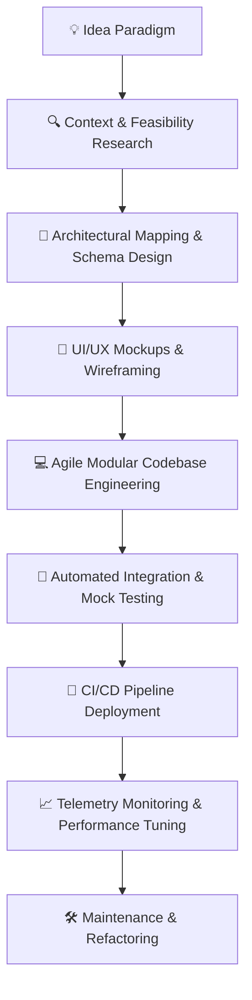

# 🌌 NQXKHOI | Nguyễn Minh Khôi

[](https://git.io/typing-svg)

---

## 🚀 INTRODUCTION

I am **Nguyễn Minh Khôi** (alias `@nqxkhoi`), an AI Application Developer, Workflow Automation Specialist, and Digital Content Creator based in Cần Thơ, Việt Nam.

Operating at the intersection of **Artificial Intelligence** and **Modern Software Architectures**, I build autonomous agentic pipelines, design next-generation full-stack web platforms, and craft seamless digital experiences. As an active collaborator for **Garena Free Fire Vietnam** and a proud member of the **SGM Network**, I merge complex software paradigms with interactive media strategies to deliver systems that think, scale, and inspire.

My mission is to engineer systems that remove operational friction through cognitive intelligence. Whether deploying custom LLM-powered applications, mapping complex multi-agent flows, or structuring responsive frontend aesthetics, I aim for nothing less than absolute engineering excellence.

---

## 📋 QUICK INFORMATION

*   **Name:** Nguyễn Minh Khôi
*   **Location:** Cần Thơ, Việt Nam 🇻🇳
*   **Birthday:** 01 June 2008
*   **Current Roles:**
    *   Garena Free Fire Vietnam Collaborator
    *   Member of SGM Network
    *   Garena Free Fire Content Creator
*   **Specialization:** AI App Development, AI Website Development, AI Automation, Prompt Engineering
*   **Interests:** Gaming, Movies, Music, Artificial Intelligence, Modern Technology
*   **Status:** Open to Collaboration on Autonomous Systems & AI Architectures

---

## 🛠️ TECH STACK

### Programming Languages


### Frontend & Design


### Backend & Databases


### Cloud, DevOps & Automation


---

## 🤖 COGNITIVE ARTIFICIAL INTELLIGENCE

I design and deploy premium LLM-powered applications and system-wide automation pipelines.

### Key Focus Areas
*   **Prompt Engineering:** Optimized dynamic context loading & few-shot reasoning models.
*   **LLM Applications:** Multi-model agent orchestration (OpenAI, Gemini, Claude).
*   **AI Agents & Automation:** Autonomous event-driven workflow chains using **n8n** and **Make**.
*   **Retrieval-Augmented Generation (RAG):** Context-aware searching using vector databases and embeddings (Supabase Postgres, Pinecone).
*   **Model Context Protocol (MCP):** Dynamic runtime integrations connecting custom APIs and host databases directly to localized models.
*   **AI-assisted Development:** Highly refined integration of workspace tooling (Cursor, GitHub Copilot).

---

## 🪐 FEATURED PROJECTS

*To display your pinned projects automatically, you can configure your pinned repositories on your main GitHub profile dashboard. Here are some of my flagship open-source implementations:*

### 🌌 NebulaAgent — Multi-Agent OS
*   **Repository:** `nqxkhoi/nebula-agent`
*   **Description:** Multi-agent autonomous terminal coordinator integrating Gemini 1.5 Pro, Model Context Protocol, and Supabase vector store for persistent semantic memory.
*   **Tech Stack:** TypeScript, n8n, Supabase, Gemini API, MCP
*   **License:** MIT
*   **Status:** Stable (Active Development)
*   **Links:** [Repository Link](https://github.com/nqxkhoi) | [Live Demo](https://github.com/nqxkhoi)

### 🌋 Garena FF Automator Pro
*   **Repository:** `nqxkhoi/ff-automator-pro`
*   **Description:** Automated video compilation and highlight cutting suite built for Free Fire collaborators. Uses multimodal AI models to recognize battle log markers and render highlight outputs.
*   **Tech Stack:** Python, Docker, FFmpeg, Gemini Multimodal
*   **License:** GPL-3.0
*   **Status:** Beta (85% completed)
*   **Links:** [Repository Link](https://github.com/nqxkhoi) | [Live Demo](https://github.com/nqxkhoi)

---

## ⚙️ DEVELOPMENT WORKFLOW ARCHITECTURE

Below is the standard, end-to-end telemetry workflow applied to all software and AI automation projects:



---

## ⚡ INSTANT SPARK (CURRENT STATUS)

*   **Actively Building:** Scaling distributed workflow engines with real-time analytics monitoring dashboards.
*   **Absorbing:** Deep-diving into Kotlin Multiplatform (KMP), distributed database consistency patterns, and audio transcript models.
*   **Reading:** *Designing Data-Intensive Applications* by Martin Kleppmann.
*   **Experimenting:** Deploying and optimizing small-scale LLMs (under 8B parameters) on consumer mobile chips.

---

## 📊 GITHUB SPECTRAL METRICS

[](https://github.com/anuraghazra/github-readme-stats)

[](https://github.com/anuraghazra/github-readme-stats)

[](https://git.io/streak-stats)

[](https://github.com/ashutoshgwxr/github-readme-activity-graph)

---

## 🏆 TROPHY HALL

[](https://github.com/ryo-ma/github-profile-trophy)

---

## 📜 DEVELOPER MAXIMS

[](https://github.com/piyushsuthar/quotes-github-readme)

---

## 🎧 CYBER SOUNDWAVE (SPOTIFY TELEMETRY)

[](https://github.com/novatorem/spotify-widget)

---

## 🐍 CONTRIBUTION EXPANSION GRID (SNAKE GRAPHICS)


<!-- 
  🚀 CONFIGURING AUTOMATED CONTRIB SNAKE GENERATION
  To activate the snake animation generator on your profile, place the following script 
  inside `.github/workflows/generate-snake.yml` inside your profile repository (nqxkhoi/nqxmkhoi):

  ```yaml
  name: generate animation
  on:
    schedule:
      - cron: "0 */12 * * *" 
    workflow_dispatch:
    push:
      branches:
      - master
  jobs:
    generate:
      runs-on: ubuntu-latest
      timeout-minutes: 10
      steps:
        - name: generate github-contribution-grid-snake.svg
          uses: Platane/snk/svg-only@v3
          with:
            github_user_name: ${{ github.repository_owner }}
            outputs: |
              dist/github-contribution-grid-snake.svg
              dist/github-contribution-grid-snake-dark.svg?palette=github-dark
        - name: push github-contribution-grid-snake.svg to the output branch
          uses: crazy-max/ghaction-github-pages@v3.1.0
          with:
            target_branch: output
            build_dir: dist
          env:
            GITHUB_TOKEN: ${{ secrets.GITHUB_TOKEN }}
  ```
-->

---

## 📞 SECURING TRANSMISSION

Whether you are looking to consult on custom automated architectures, deploy LLM infrastructure nodes, develop modern user platforms, or discuss esports integrations and video production workflows:

*   **Direct Wire:** Reach out via email at [nguyenminhkhoi.booking@gmail.com](mailto:nguyenminhkhoi.booking@gmail.com)
*   **Other Channels:** Join the matrix on [Facebook](https://www.facebook.com/nqzkhoi) or connect with me via [Discord](https://discord.com/channels/@nqxkhoi)
*   **Active Sync:** Always open to collaborate on bleeding-edge open-source repositories and AI agent frameworks. Let's build something beautiful together.

---

🌐 SYSTEM VECTORS FULLY ALIGNED • VISITATION COMPLETE  
Designed with ❤️ and cognitive AI by Nguyễn Minh Khôi (nqxkhoi). All rights reserved.
